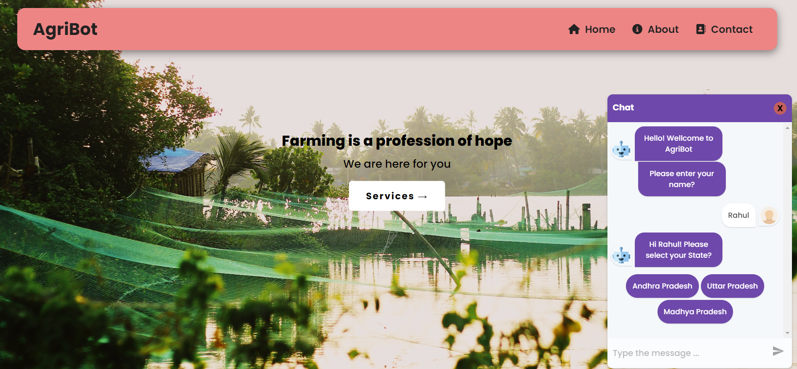
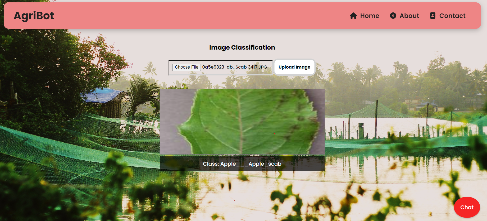
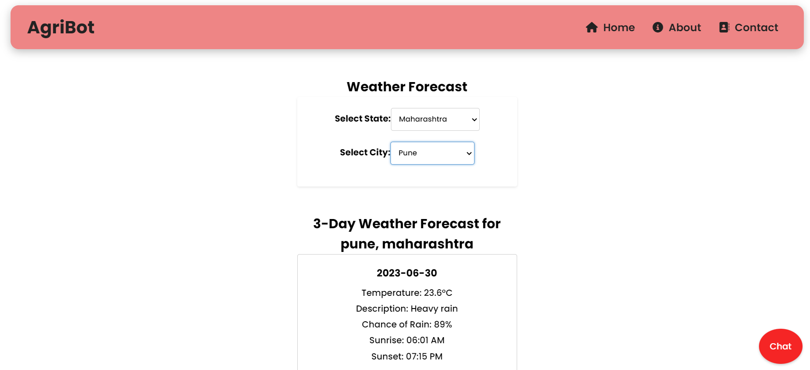

# React-Flask AI Project

## AgriBot: An AI-Powered Farmer's Companion


A web application built with React and Flask, providing weather forecast, Crop disease and farming information using an APIs.

## Prerequisites

Before running the project, make sure you have the following prerequisites installed:

- Node.js
- Python
- Flask
- TensorFlow
- Joblib
- Pillow


# Installation

1. Clone the repository:

   ```bash
   git clone https://github.com/Rahulrayudu/farmapp.git
   ```

2. For the falsk server install the required packages for Flask, TensorFlow, joblib, Pillow. 
<br>

3. Get an API key for the weather information. Sign up for an account and generate the key on the Weather API website. Add the api key inside the main.py
<br>

# Usage
1. Start the Flask server:

   ```bash
   cd flask_server
   python main.py
   ```

2. Build and run the React frontend:
  
   ```bash
   cd react-frontend
   npm install
   npm start
   ```
3. Open your browser and visit http://localhost:3000 to access the AI chatbot for farmers.
   

4. Chat with the bot
  

5. Crop disease classification
  

6. Weather forecasting
 

# Technologies
* React
* Flask
* TensorFlow


# Contributing
Contributions are welcome! If you find any issues or have suggestions for improvements, please open an issue or submit a pull request.


